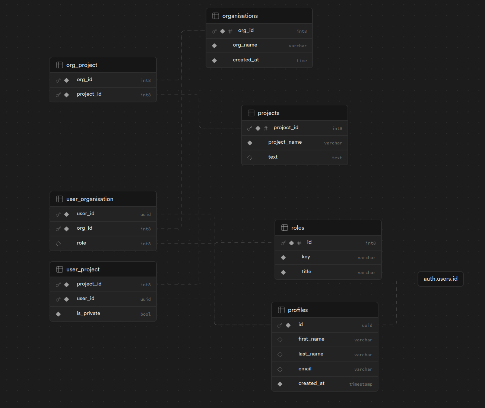

## Nuxt + Supabase

Nuxt Supabase is a getting started template for Nuxt + Supabase projects, having pre configued Auth, RLS, policies, Nuxt UI, Tailwind setup

## 📹 Preview

https://github.com/vue-simform/nuxt-supabase-rls/assets/152366223/97227864-4c8b-431d-b057-405442394a46

## Clone

Open the folder where you want to setup the project

```bash
git clone https://github.com/vue-simform/nuxt-supabase-rls .
npm install
```

## Supabase Setup

1. Login To [Supabase](https://supabase.com)
2. Create a new project.
   > Note: Remember / copy your database password to somewhere safe.

## Project Setup

1. Go to [Supabase Dashboard](https://supabase.com/dashboard/projects) & select your project while you have just created
2. Go to setting, then under database, `API` tab.
3. Now open your project, create a `.env` file in the projects root.

```
SUPABASE_URL="https://abc.supabase.co"
SUPABASE_KEY="YOUR_KEY"
SUPABASE_SERVICE_KEY="YOUR_SERVICE_KEY"
HOST="http://localhost:3000"
```

4. Follow the above `.env` format and copy & past **your** credentials in that file.

## Database Setup

1. To have the same replica of DB structure as mine. Go to Supabase SQL Editor
2. Copy paste [this](docs/migrations.txt) into your Supabase SQL editor.
3. Next step is to select all (cmd + A / control + A) & then Run Selected.

## Login Supabase from terminal

```bash
npx supabase login
```

1. A like will appear when you enter above command. Click on that link.
1. Generate a token, & copy it. _Remember to save that token somewhere_
1. Paste that token in terminal.

## Generate types

> As we are using typescript Generating Types is also a important step to get all the type hinting in our project

1. Go to project Settings, & then General where you will find, project referance ID
2. Run the following command in the projects root

```
npx supabase gen types typescript --project-id YOUR_PROJECT_REFERANCE_ID > database-generated.types.ts
```

> Note: Substitute your project referance id instead of YOUR_PROJECT_REFERANCE_ID

## Azure Auth (Optional)

Follow the steps mentioned [here](https://supabase.com/docs/guides/auth/social-login/auth-azure)

## Run the project

```bash
npm run dev
```

Start the development server on `http://localhost:3000`:

Check out the [deployment documentation](https://nuxt.com/docs/getting-started/deployment) for more information.

## Project Flow

1. For user login you first have to `register`. Go to [http://localhost:3000/register](http://localhost:3000/register) & register the users.
1. After registration, a **login link** will be sent to the users email account.
1. Clicking on that link will simply login user, also your email will be verified (By Default done by Supabase).
1. Now you can access the `organisations` tab which was unaccessabe earlier.
1. You will see that you are not added to any organisation.
1. You can do it manually, through [Supabase Dashboard](https://supabase.com/dashboard/projects)

## Features

1. Use of modern tools like Nuxt 3, Typescript & Tailwind
1. Ready made & fully scalable Auth systeam
1. Nuxt UI library integrations for seemless user experience
1. Supabase tables, RLS, policies, triggers setup pre configued and fully scalable.
1. vee-validate with composition api pre setup in auth pages.
1. Route guard

## Page Structure

```
/ - Home Page

/login - Login Page

/register - Registration Page

/profile - Profile Page
Auth Guard Enabled

/organisations - List of users organisations (organisations user is part of)
Auth Guard Enabled

/organisations/[id] - Organisations specific page
Auth Guard Enabled
Note here, if user try to access specific organisation by url,
then user should be the part of that organiastion, otherwise
it will show that user is not part of organisation as RLS is enabled

/organisations/[id]/projects - List of all Organisations project
Auth Guard Enabled

/organisations/[id]/projects/[projectId] - Organisation Project specific page
Auth Guard Enabled
Here also same check as Organisation is applied
```

## Database Schema


